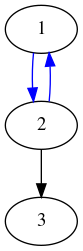

# GPU forward progress: formal verification of asbence of deadlocks

This is a specification of GPU programs doing inter-workgroup synchronizations,
under semi-fair schedulers.

It relies on [CADP](http://cadp.inria.fr/) tools.

To generate the LTS of e.g. prod_cons_obe:

```
# Generate the state space into a BCG (i.e. explicit LTS) file:
lnt.open prod_cons_obe.lnt generator prod_cons_obe.bcg

# See the graph:
bcg_edit prod_cons_obe.bcg

# You sometimes get better graph drawings using graphviz dot format:
bcg_io prod_cons_obe.bcg -graphviz prod_cons_obe.dot
xdot prod_cons_obe.dot
```

Verification can be scripted via SVL scripts, for instance you can run:

```
svl prod_cons.svl
```

## Some definitions

[CADP](http://cadp.inria.fr/) is a verification toolbox, and the following are
tools and languages related to it:

- LNT (Lotos NT) is a specification language, it is defined by the LNT-to-LOTOS
  translator reference manual, first published in 2005, but regularly updated:
  http://cadp.inria.fr/publications/Champelovier-Clerc-Garavel-et-al-10.html

- LTS means Labelled Transition System, we use this to represent the state-space
  of a model. States (vertices) have no information except a state number, only
  the label of transitions (edges) contains information. See wikipedia:
  https://en.wikipedia.org/wiki/Transition_system

- BCG is Binary Coded Graph, it is a binary format to store LTS.

- MCL is the Model Checking Language, a value-passing modal mu-calculus temporal
  logic used to express properties to be verified on models. MCL is the
  language, the CADP tool that process it is "evaluator". Here we use MCL
  version 4 (associated with evaluator4), as defined by its manual page:
  http://cadp.inria.fr/man/mcl4.html
  
  A good intro to MCL is section 3 "Analysis of Mutual Exclusion Protocols using
  CADP" of the paper "Model Checking and Performance Evaluation with CADP
  Illustrated on Shared-Memory Mutual Exclusion Protocols" (2013) :
  http://cadp.inria.fr/publications/Mateescu-Serwe-13.html

- SVL (Script Verification Language) is a scripting language to use CADP
  tools. An SVL script expresses a verification scenario in a more readable and
  convenient way that a series of calls to CADP tools. SVL scripts can embed
  verification properties which are written in MCL. The SVL language is defined
  in http://cadp.inria.fr/man/svl-lang.html

### LTS generated from LNT

LTS generated from LNT only retain in their labels the actions on gates in the
LNT program, with the gate name and their arguments.

Also, a special label "exit" is inserted at the end, i.e. when all processes
terminate. If some process in the LNT program can never terminate, then there
will be no final "exit" transition.

## Threads and cycles

Alloy generates tests, which are small concurrent programs. We use CADP to
answer this question: For a test T generated by Alloy, under a scheduler S, can
t deadlock?

Hereafter, a deadlock means: an execution path with a cycle ("lasso") of
execution steps of fairly scheduled threads.

Our Alloy specification is crafted to generate tests that have the following
properties:

- they can always terminate under strong fairness

- they have at least one cycle in their execution, which may or may not be a
  deadlock depending on the scheduler.

CADP does not verify a test on its own: it verifies a test under a specific
scheduling. Moreover, some schedulers are sensible to occupancy, i.e. the number
of threads which can be scheduled at the same time. So our question is:

For a test T under a scheduler S (with, if relevant, occupancy O), is there a
possible deadlock?

### Having a single LTS for all occupancies

When a scheduler S is sensible to Occupancy, we may generate a different LTS for
all relevant values of occupancy, typically between 1 and the total number of
threads in the test. We can also have a single LTS that start by picking up an
occupancy level (== number of execution tokens) randomly between 1 and the
number of threads, and executes from there. This leads to a single LTS for all
relevant values of occupancy, where the very first transition denotes which
occupancy level has been chosen.

TODO Hugues: an example with prod-cons OBE occupancy between 1 and 2.

### Types of deadlock

A deadlock is related to cycles of execution steps. Let's call F the set of
fairly scheduled threads. Note that for semi-fair schedulers, F is typically
varying along the execution path: as execution goes on, some threads may join or
leave F.

Let's consider HSA. F always contains a single thread: the active thread with
the lowest ID. When the thread in F terminates, the next active thread with the
lowest ID replaces it in F.

In OBE, as soon as a thread makes an execution step, it becomes an element of F,
until the thread terminates.

Let's look at possible shapes of cycles. For now, we consider that F is stable
during a cycle, i.e. no thread go in or out of F during the cycle. Let's call
Tcycle the set of threads which are making execution steps in the cycle, and
Tbreak the set of threads for which an execution step may break out of the
cycle.

Let's consider some cases.

Note: in the graphs below, blue edges denote execution steps of fairly scheduled
threads.


#### Cycle of fairly scheduled threads

\forall t \in Tcycle, t \isin F



This is an issue, as all threads in the cycle are guaranteed fair scheduling.

But we have to consider Tbreak here, the thread which can get out of this cycle:

- if Tbreak is not in F, it has no guarantee to be scheduled. Here we have a
  deadlock.
  
- if Tbreak is in F:

  - if Tbreak is part of Tcycle, then it does executes regularly
  
  - if Tbreak is not part of Tcycle, then it is guaranteed to be scheduled, and
    thus break out of the cycle

#### Cycle with at least one non-fairly scheduled thread


Are we interested in these?

If we restrict to only the fairly scheduled threads, we would not consider such
cycles. But if there are enough execution tokens to execute threads that are not
strictly guaranteed execution, the non-fairly scheduled threads may perturbate
the fairly scheduled ones such that such loops are an issue?

## A token-based execution model

The first draft of Schedulers are defined with respect to a certain number of
Compute Units. We can reach something more flexible with a token-based execution
model, where threads can execute only if they have a (virtual) token from the
scheduler. The total number of tokens is picked up randomly between 1 and the
total number of threads. The threads that are fairly scheduled are guaranteed to
have a token.

In practice, we consider the following sets of threads:

- `A` is the set of **active** threads, i.e. threads that have not terminated
  yet and which may be scheduled.
  
- `E` is the set of **enabled** threads, i.e. treads to which the scheduler have
  given a token.

- `F` is the set of **fairly scheduled** threads, i.e. threads that are
  guaranteed to be given a token.

We have the following invariants:

- F is a subset of E, which is a subset of A

- card(E) is lower or equal to the number of tokens

A scheduler definition looks like:

```
process SCHEDULER_X [EX: ExChan, TERMINATE: NatChan, NUM_TOKEN: NatChan] (numThread: nat) is
  var
    A, E, F: NatSet,
    numTokens: nat,
    tid: nat,
    ...
  in

    -- At the beginning, all threads are active
    for tid := 0  while tid < numThreads by tid := tid + 1 loop
      A := insert(A, tid)
    end loop;

    -- randomly pick a number of token within a relevant bound
    NUM_TOKEN(?numTokens) where (0 < numTokens) and (numTokens <= numThreads);

    -- main loop
    loop sched_loop in

      -- Scheduler-specific logic to set F and E
      F := ...
      E := ...
      assert F isSubsetOf E;

      select

        EX(?tid, ...) where tid isElementOf E;
        -- Maybe some scheduler-specific logic
        E := ...
        F := ...

      []

        TERMINATE(?tid);
        A := remove(tid, A);

        if isEmpty(A) then
          -- all threads are terminated, let's terminate the scheduler
          break sched_loop
        end if;

        -- Maybe some scheduler-specific logic
        E := ...
        F := ...

      end select
    end loop
  end var
end process
```

Note that A, E and F may be modified at each iteration of the loop.

Let's write HSA with this style:

```
-- NOTE: THIS WON'T COMPILE AS-IS, NEED TO FIX SOME SET-RELATED PRIMITIVES

-- This pragma speeds up all generation of sets of naturals,
-- by bounding the naturals to include in the enumerations.
!nat_sup <number of threads>

process SCHEDULER_HSA_TOKEN [EX: ExChan, TERMINATE: NatChan, NUM_TOKEN: NatChan] (numThread: nat) is
  var
    A, E, F: NatSet,
    numTokens: nat,
    tid: nat
  in

    -- At the beginning, all threads are active
    for tid := 0  while tid < numThreads by tid := tid + 1 loop
      A := insert(A, tid)
    end loop;

    -- Randomly pick a number of token within a relevant bound
    NUM_TOKEN(?numTokens) where (0 < numTokens) and (numTokens <= numThreads);

    -- main loop
    loop sched_loop in

      -- Only the active thread with the lowest ID is guaranteed fairly scheduling
      for tid := 0 while tid < numThreads by tid := tid + 1 loop
        if tid isElementOf A then
          F := NatSet(tid);
          break
        end if
      end loop;

      -- Threads other than the one in F may be enabled if there are some tokens for them
      -- This will randomly pick new threads not in F at every iteration of the main loop
      E := any NatSet where (F isSubsetOf E) and (E isSubsetOf A) and (card(E) <= numTokens);

      assert F isSubsetOf E;
      assert E isSubsetOf A;

      select

        EX(?tid, ...) where tid isElementOf E;
        -- Nothing special to do for HSA

      []

        TERMINATE(?tid);
        A := remove(tid, A);

        if isEmpty(A) then
          -- all threads are terminated, let's terminate the scheduler
          break sched_loop
        end if;

        -- Nothing special to do for HSA

      end select
    end loop
  end var
end process
```
